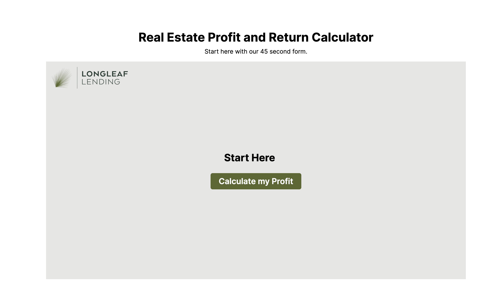
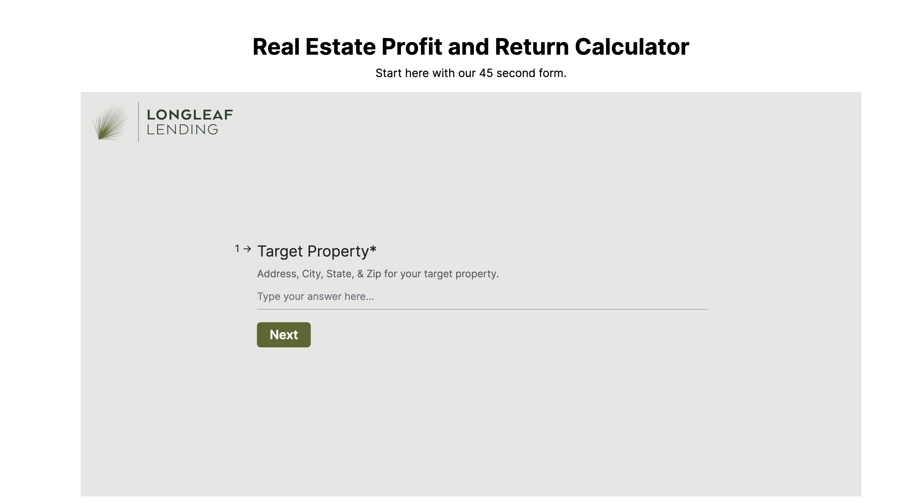

# Lead Generation Form and Profit Calculator

This project is an in-house lead generation form and profit/return calculator. The form collects user input, calculates estimated profits, and generates a term-sheet PDF that is emailed to the user.

## Features

- Multi-step form to collect user details and property information.
- Logic implementation to calculate estimated profit based on input details.
- PDF generation including client and property details, loan calculations, and terms and conditions.
- Email integration to send the generated PDF to the user upon form submission.

## Technologies Used

- Ruby on Rails
- Tailwind CSS
- Prawn for PDF generation
- Sidekiq for background job processing
- Letter Opener for email preview in development
- Standard gem for linting

## Setup Instructions

1. Clone the repository:

    ```bash
    git clone <repository_url>
    cd longleaf_lending
    ```

2. Install dependencies:

    ```bash
    bundle install
    ```

3. Set up the database:

    ```bash
    rails db:create
    rails db:migrate
    ```

4. Start the Rails server:

    ```bash
    bin/start
    ```
  This will start Rails, Tailwind CSS and Sidekiq server

5. Open your browser and navigate to:

    ```
    http://localhost:3000
    ```

## Running Tests

To run the test suite, execute the following command:

```bash
bundle exec rspec
```

## Thought Process and Design Decisions

### Form Creation

-   **Multi-step Form**: We created a multi-step form to enhance user experience by breaking down complex inputs into manageable steps, reducing user overwhelm.
-   **Tailwind CSS**: Tailwind CSS was selected for its utility-first approach, enabling rapid, consistent, and responsive design implementations.

### Logic Implementation

-   **Constraints and Calculations**: The loan amount is restricted to 90% of the purchase price or 70% of the ARV to meet lending criteria, with profit calculated as ARV minus total loan value and interest expense.
-   **Service Objects**: Service objects (`LeadCalculatorService` and `PdfGeneratorService`) were used to encapsulate business logic, adhering to the single responsibility principle for maintainability and testability.

### PDF Generation

-   **Prawn**: Prawn was chosen for its flexibility in PDF generation, allowing detailed customization for client and property information, loan calculations, and terms.
-   **Design Consistency**: Maintaining consistent design across the form and PDF ensures a professional and cohesive user experience.

### Email Integration

-   **Sidekiq**: Sidekiq handles email sending asynchronously to avoid disrupting user experience during PDF generation and delivery.
-   **Letter Opener**: Letter Opener is used in development to preview emails in the browser, simplifying debugging and verification of email content.

## Screenshots
 - Here is the Few screenshots from the project.
  
  
  

## PDF Example


  Check the example of PDF file [here](./docs/pdf/loan_summary_report.pdf).
